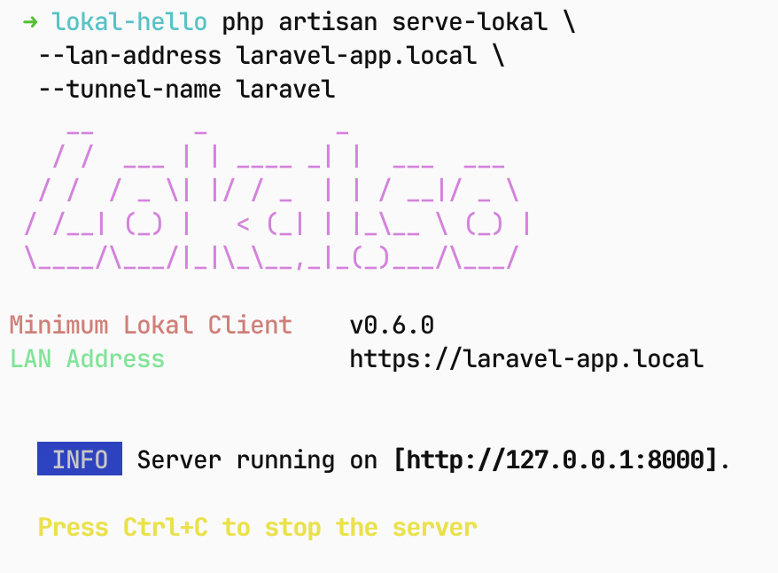
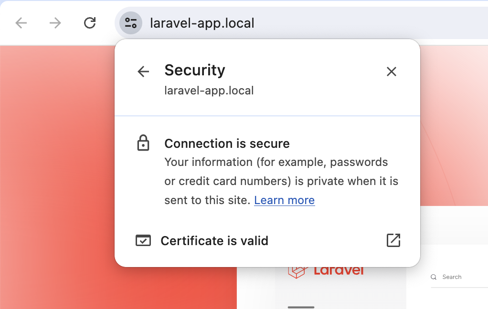

# Lokal.so Laravel Provider

this laravel provider is used for adding your artisan command additional argument `php artisan serve-lokal`

| CLI Preview | Browser Preview |
|---|---|
|   |  |

## Installing Package

```sh
composer require lokal-so/lokal-laravel
```

## Usage

```sh
php artisan serve-lokal \
  --lan-address my-laravel.local \
  --tunnel-name laravel
```